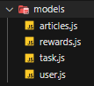
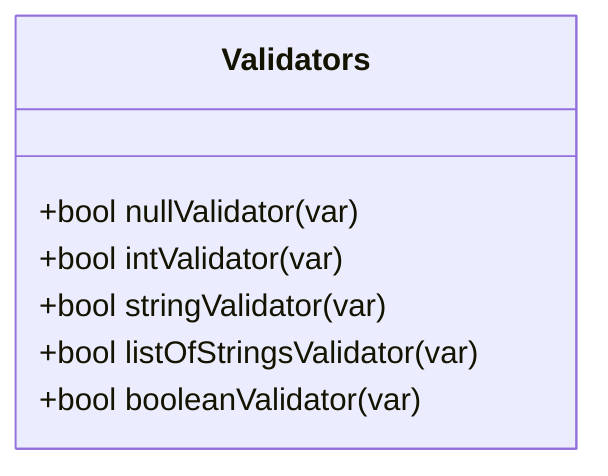

# SavingOurOceans-Backend 🐳

Hola nosotros somos el equipo de ```EXPLORERS H2O``` 🐟

</br>

Se nos hizó el challenge de generar un desarrollo de software que buscará combatir la problemática que se esta viviendo hoy en día respecto a los oceanos.
Elegimos tomar el camino de crear el desarrollo del proyecto SavingOurOceans🐠, un proyecto que incentiva a las personas y empresas a generar un cambio, pero de una manera en la que no se requiera que estas vivan u operen cerca del mar, una manera en la que tanto los usuarios, las empresas y nuestros oceanos salgan beneficiados de esta puesta en acción.

Elegimos la problemática de la **Contaminación de los Oceanos** 🌊, la cual es de las más preocupantes hoy en día.

Nuestro desarrollo es una aplicación web que por medio de un sistema de puntos incentive a los usuarios a tomar acción para mejorar esta situación, los puntos pueden ser obtenidos mediante la difusión de información de la problemática, difusión de artículos científicos, artículos de campañas de ayuda y colaborción comunitaria, entre otras.

Además el usuario podrá ganar puntos mediante el cumplimiento de tareas específicas que ayuden al medio ambiente, (tareas medibles y comprobables) propuestas por ```EXPLORERSH2O```💧, muchas de estas tareas buscarán que el usuario se involucre y genere el gusto por llevar a cabo acciones que ayuden en contra de la contaminación marina, lo que SavingOurOceans🐡 busca es generar difusión masiva del proyecto y un cambio social que genere un impacto real, pero y ¿Como se involucran y ayudan las empresas? 

Bueno, las empresas se asocian al proyecto de SavingOurOceans🐙, otorgando recompensas a los usuarios a cambio de los puntos, recompensas que ellos junto con el equipo del proyecto decidan ofrecer a nuestros usuarios, estas recompensas pueden ir desde descuentos, productos en collab con SavingOurOceans🦑, entre otros. El único requisito que las empresas tendrán que hacer es ponerse bien la camisa y también buscar hacer un cambio.

El desarrollo de la aplicación web consta de 2 partes:
- [x] El [Desarrollo en Frontend](https://github.com/Elchicogamer117/savingouroceansfrtnd) de la aplicación Web 
- [App Web](https://elchicogamer117.github.io/savingouroceansfrtnd/index.html)
- [x] El [Desarrollo en Backend](https://github.com/OlafRuv/SavingOurOceans-Backend) de una API para el manejo de Datos de la aplicación
- [API](https://saveouroceanapi.azurewebsites.net/)


## Herramientas 🐋

| Herramientas |                   Version                   |
| :----------: | :------------------------------------------: |
|     Node     |                   v16.14.0                   |
|     Npm     | v8.3.1 (It comes with the Node installation) |
|     Jest     |                 v26.0.04.18.                 |
|   Express   |                   v4.18.1                   |
|    Prisma    |                   v3.14.0                   |
|    Eslint    |                   v8.15.0                   |
|  PostgreSQL  |                    v14.3                    |
|   Postman   |                    🐱‍🏍                    |
|     Git     |              v2.35.1.windows.2              |
|    Github    |                    🐱‍💻                    |

## Diseño de Solución 🐟

Para nuestra aplicacion decidimos separar el desarrollo del Frontend del Backend. 🐱‍🐉

Para el desarrollo del **Backend** hicimos la abstracción del sitema en *Modelos de Datos*, *Servicios* para crear datos en base a los modelos y sus respectivos *Controladores,* los cuales se encargan de la comunicación entre el API, la *Base de Datos* de Postgresql y los Servicios para creación de datos, además desarrollamos una serie de *Validadores* de datos para eliminar el problema de inconsistencia de datos y de registro de información erronea en la BD. 😉

Para garantizar Calidad 😎 en el desarrollo del backend usamos el modelo de desarrollo **TDD** *Desarrollo Dirigido por* *Pruebas* por sus siglas en ingles Test Driven Development, todas las pruebas se desarrollaron haciendo uso de jest y se validaron modulos, controladores y servicios.

Nuestro sistema debía de almacenar datos por lo cual montamos una Base de Datos de PostgreSQL 🐘 para el almacenamiento de los mismos, por cuestiones de optimización de tiempo usamos Prisma para crear la base de datos a partir de modelos de datos de Prisma y de Semillas o Seeds para la inserción de información de prueba.

Por último para el acceso a la aplicación de Backend que desarrollamos, decidimos montar la API y la BD en la infraestructura de **Azure** puesto que es altamente escalable, mantenible y accesible 💙


## Implementación 🦈

### Modelos 🐠

Creamos modelos de datos para las siguientes clases



Cada una de ellas haciendo uso del paradigma de programación **POO**

* Ejemplo ``class Rewards``

```js
class Rewards{
	constructor(id,sponsor,code,pointsValue,name,type,deadLine){
		this.id = id;
		this.sponsor = sponsor;
		this.code = code;
		this.pointsValue = pointsValue;
		this.name = name;
		this.type = type;
		this.deadLine = deadLine;
	}

	get getId(){
		return this.id;
	}
	get getSponsor(){
		return this.sponsor;
	}
	get getCode(){
		return this.code;
	}
	get getPointsValue(){
		return this.pointsValue;
	}
	get getName(){
		return this.name;
	}
	get getType(){
		return this.type;
	}
	get getDeadLine(){
		return this.deadLine;
	}

	set setId(id){
		this.id = id;
	}
	set setSponsor(sponsor){
		this.sponsor = sponsor;
	}
	set setCode(code){
		this.code = code;
	}
	set setPointsValue(pointsValue){
		this.pointsValue = pointsValue;
	}
	set setName(name){
		this.name = name;
	}
	set setType(type){
		this.type = type;
	}
	set setDeadLine(deadLine){
		this.deadLine = deadLine;
	}
}

module.exports = Rewards;
```


### Controladores y Servicios 🐙

Para los modelos de datos creados desarrollamos sus Controladores y Servicios

* Ejemplo ``class Tasks`` Servicio

```js
const Task = require("./../models/task");

class TaskServices{
	static createTask(id, description, points, itsDone, itsAvailable){
		return new Task(id,description,points,itsDone, itsAvailable);
	}
	
	static getInfo(task){
		const taskInfo = {
			id: task.getId,
			description: task.getDescription,
			points: task.getPoints,
			itsDone: task.getItsDone,
			itsAvailable: task.getItsAvailable,
		};
		return taskInfo;
	}  

	static updateItsAvailable(task, isAvailable){
		task.setItsAvailable = isAvailable;
		return task;
	}

	static updateItsDone(task, isDone){
		task.setItsDone = isDone;
		return task;
	}

	static getPoints(task){
		return task.getPoints;
	}

	static updatePoints(task, points){
		task.setPoints = points;
		return task;
	}
}

module.exports = TaskServices;
```

* Ejemplo ``class Tasks`` Controlador
```js
const TaskServices = require("./../services/taskServices");
const Validators = require("./../utils/validators");

class TaskController{
    
	static validateReward(task){
		if(Validators.nullValidator(task)) {
			return "Error null value";
		}
		else if(Validators.stringValidator(task.description) || Validators.intValidator(task.points) || Validators.booleanValidator(task.itsDone) || Validators.booleanValidator(task.itsAvailable)) {
			return "Error incorrect variable types"; 
		}
		else{
			return "All good";
		}
	}

	static createTask(task){
		if (TaskController.validateReward(task) != "All good"){
			return TaskController.validateReward(task);
		}

		const taskResponse = TaskServices.createTask(task.id,task.description,task.points,task.itsDone,task.itsAvailable);
		return taskResponse;
	}

	static getInfo(task){
		if (TaskController.validateReward(task) != "All good"){
			return TaskController.validateReward(task);
		}

		const tk = TaskController.createTask(task);
		const taskResponse = TaskServices.getInfo(tk);
		return taskResponse;
	}  

	static updateItsAvailable(task, isAvailable){
		if (TaskController.validateReward(task) != "All good"){
			return TaskController.validateReward(task);
		}

		const tk = TaskController.createTask(task);
		const taskResponse = TaskServices.updateItsAvailable(tk,isAvailable);
		return taskResponse;
	}

	static updateItsDone(task, isDone){
		if (TaskController.validateReward(task) != "All good"){
			return TaskController.validateReward(task);
		}

		const tk = TaskController.createTask(task);
		const taskResponse = TaskServices.updateItsDone(tk,isDone);
		return taskResponse;
	}

	static getPoints(task){
		if (TaskController.validateReward(task) != "All good"){
			return TaskController.validateReward(task);
		}

		const tk = TaskController.createTask(task);
		const taskResponse = TaskServices.getPoints(tk);
		return taskResponse;
		
	}

	static addPoints(task, points){
		if (TaskController.validateReward(task) != "All good"){
			return TaskController.validateReward(task);
		}

		const tk = TaskController.createTask(task);
		const newPts = TaskServices.getPoints(tk) + points;
		const taskResponse = TaskServices.updatePoints(tk,newPts);
		return taskResponse;
	}

	static subPoints(task, points){
		if (TaskController.validateReward(task) != "All good"){
			return TaskController.validateReward(task);
		}

		const tk = TaskController.createTask(task);
		const newPts = TaskServices.getPoints(tk) - points;
		if(newPts < 0){
			return "Error: cantidad de puntos negativa";
		}
		const taskResponse = TaskServices.updatePoints(tk,newPts);
		return taskResponse;
	}
}

module.exports = TaskController;
```

### Utilidades 🦑

Se crea una clase `Validators` que servirá para la validación de los diversos tipos de datos
a utilizar. Sus funciones simplemente regresarán un booleano.


### Pruebas 🦞
Para validar nuestro código, creamos pruebas unitarias que corrobora que las funciones 
hagan lo que se espera. Para esto utilizamos la dependencia `jest`. Las pruebas unitarias se
crearon para:

| Models | Services | Controllers |
| ----------- | -------- | ----------- |
| UserControllers.js | UserServices.js | User.js |
| TaskControllers.js | TaskServices.js | Task.js  |
| RewardControllers.js | RewardServices.js | Reward.js |

A continuación veremos un ejemplo del código para las pruebas

```js
const TaskServices = require("./../../../lib/services/taskServices"); 

describe("Task model",() =>{
	test("1) Create task", () => {
		const task = TaskServices.createTask(1,"Task Description",10,true,true);
		expect(task).not.toBeNull();
		expect(task.id).toBe(1);
		expect(task.description).toBe("Task Description");
		expect(task.points).toBe(10);
		expect(task.itsDone).toBe(true);
		expect(task.itsAvailable).toBe(true);
	});
  
	test("2) Test getInfo", () => {
		const task = TaskServices.createTask(1,"Task Description",10,true);
		const taskInfo = TaskServices.getInfo(task); 
		expect(taskInfo).not.toBeNull();
		expect(taskInfo).toBeInstanceOf(Object);
		expect(taskInfo.id).toBe(1);
	});
  
	test("3) Test updateItsDone", () => {
		const task = TaskServices.createTask(1,"Task Description",10,true,true);
		const t = TaskServices.updateItsDone(task, false);
		expect(t.itsDone).toBe(false);
	});
})
```
Para correr las pruebas, utilice el siguiente comando desde la terminal.

```bash
> npm test
```

### Automatización de Pruebas 🦐
Para la automatización de pruebas, utilizamos *Github actions* para facilitar el proceso de verificación de errores, y evitar que esos errores se lleguen a subir al servidor, ocasionando problemas más graves.

El código utilizado para automatizarlo es el siguiente: 
```yaml
name: CI
on: push
jobs:
  build:
    runs-on: ubuntu-latest
    steps:
    - uses: actions/checkout@v2
    - name: Install modules
      run: yarn
    - name: Run tests
      run: yarn test

```

### API 🌊
La página web necesita de un servicio API que es el que se encargará de enlazar el frontend con el backend. Para eso nosotros utilizamos la dependencia de *Express* para la utilización de los métodos HTTP, y para conectar los servers, *cors*.

Para ver la documentación de la API y sus *endpoints*, darle click [aquí](https://documenter.getpostman.com/view/20636313/UyxjFm6q).


### Base de Datos 🛥️

Para la creación de la base de datos, utilizamos *postgreSQL*, y para facilitar la escritura de código, se utilizó la dependencia de prisma, el cual permite agilizar la escritura de SQL.

En el archivo de `prisma/schema.prisma`, se desarrollan los modelos que estarán en la base de datos, y en dado caso de modificar o agregar un nuevo modelo/tabla, se debe de correr el siguiente comando.
```bash
> npx prisma migrate dev --name init
```
De igual manera podemos encontrar el archivo `prisma/seed.js`, el cual permite general datos para llenar nuestras tablas con cierta información inicial.

### Deployment de Aplicación 🦀

Para el deployment de la aplicación hicimos uso de Azure 💙, en donde creamos un grupo de recursos llamado Save Our Ocean, además creamos un servidor de PostgreSql para montar la base de datos y creamos un App Service para montar la API


La mayoría de consultas de información son por el método POST por lo cual se puede apreciar el funcionamiento en la sección de API


## Evolución Previsible 🐡
Por cuestiones del tiempo de desarrollo, faltaron algunas cosas por implementas, algunas de ellas son mejoras necesarias pero incluso proyectamos evoluciones del sistema que llegaron hasta el Backend de la aplicación. Estos cambios proyectados como evoluciones previsibles son los siguientes:

- [ ] Desarrollo de modelos faltantes
- [ ] Desarrollo de servicio y controladores de Artículos
- [ ] Desarrollo de pruebas de la API
- [ ] Creación de endpoints de servicios de Artículos
- [ ] Sugerencias, ponte en contacto con los ``EXPLORERS H2O``

## Colaboradores
- [@felixVelazco](https://github.com/felixVelazco) 🐠
- [@ErickCasGlez](https://github.com/ErickCasGlez) 🦐
- [@Elchicogamer117](https://github.com/Elchicogamer117) 🐡
- [@AliciaGaona](https://github.com/AliciaGaona) 🦑
- [@OlafRuv](https://github.com/OlafRuv) 🐙


